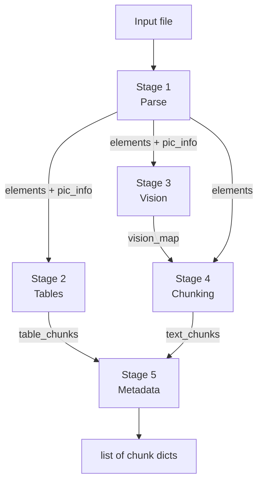

# DocumentLoader — Complete Dataflow

## Overview

`DocumentLoader` is a 5-stage structured ingestion pipeline that converts documents into
embedding-ready text chunks. It dispatches files into one of two paths based on file
extension, then enriches every chunk with contextual prefix, language, hash, and type
metadata.

---

## Public API

| Method | Input | Output |
|---|---|---|
| `load(file_path)` | path to a single file | `list[dict]` — chunk list |
| `load_directory(directory, files_filter?)` | directory path | `dict[str, list[dict]]` — filename → chunks |

`load_directory` recursively walks the directory and calls `load()` on every file whose
extension appears in `SUPPORTED_EXTENSIONS`. Files that raise an exception are logged and
skipped.

---

## Extension Dispatch

```
Input file
     │
     ▼
suffix.lower() in SUPPORTED_EXTENSIONS?
     │
     ├─ NO  ──► ValueError
     │
     ├─ PASSTHROUGH_EXTENSIONS ──► _load_passthrough()
     │    .md .markdown .adoc .asciidoc .tex
     │    .html .htm .xhtml .txt .text .vtt
     │    .wav .mp3 .m4a .aac .ogg .flac .mp4 .avi .mov
     │
     └─ PIPELINE_EXTENSIONS ──► _load_pipeline()
          .pdf .docx .xlsx .csv .pptx
          .png .jpg .jpeg .tiff .tif .bmp .webp
```

---

## Path A — Passthrough (`_load_passthrough`)

Used for plain-text and audio/video formats where deep element extraction is not needed.

```
file_path
    │
    ▼
_convert_file(path, "md")          ← POST to docling-serve /v1/convert/file
    │                                  with to_formats=md
    │  returns: raw Markdown string
    ▼
_simple_split(text, CHUNK_SIZE, CHUNK_OVERLAP)
    │  character-level sliding window
    │  CHUNK_SIZE  default 800 (env CHUNK_SIZE)
    │  CHUNK_OVERLAP default 80 (env CHUNK_OVERLAP)
    │
    ▼  for each part i:
    {
      chunk_id:            "{stem}_{i}",
      source:              "chunk",
      chunk_type:          "text",
      chunk_text_original: part,
      chunk_text_embedded: "[Document: {stem}]\n{part}",
      page_number:         null,
      section_title:       null,
      language:            _detect_language(part),   ← langdetect
      chunk_hash:          sha256(part),
    }
    │
    ▼
list[dict]  ← returned to caller
```

---

## Path B — 5-Stage Pipeline (`_load_pipeline`)

Used for rich document formats. All five stages run inside a single temporary directory
that is deleted on exit.



---

### Stage 1 — Parse (`_stage1_parse`)

Converts the raw document into a flat element list and extracts embedded pictures.

```
file_path
    │
    ├─ .xlsx  ──► _parse_excel()
    │                openpyxl reads each sheet
    │                sheet name → heading element
    │                rows → pipe-separated Markdown table element
    │                returns: elements[], pic_info=[]
    │
    ├─ .csv   ──► _parse_csv()
    │                csv.Sniffer() detects dialect
    │                file stem → heading element (sheet_name)
    │                rows → pipe-separated Markdown table element
    │                returns: elements[], pic_info=[]
    │
    └─ other  ──► _convert_file(path, "json")
                      POST to docling-serve with:
                        to_formats=json
                        image_export_mode=embedded
                        do_ocr=false
                        include_images=true
                      returns: DoclingDocument JSON dict
                  │
                  ▼
                  _extract_elements_and_pictures_from_json()
                      Builds ref_lookup from texts/tables/pictures/groups
                      _walk(body) — depth-first over children refs
                          label ∈ HEADING_LABELS   → heading element
                          label ∈ PARAGRAPH_LABELS → paragraph element
                          label ∈ LIST_LABELS       → list_item element
                          label ∈ TABLE_LABELS      → table element
                                                      (_table_to_text_from_json renders grid)
                          label ∈ PICTURE_LABELS    → picture element
                                                      + save base64 PNG to tmp dir
                  returns: elements[], pic_info[]
                  │
                  ├─ .pptx ──► _reclassify_pptx_headings()
                  │               _pptx_heading_texts():
                  │                 python-pptx scans each slide shape
                  │                 heading signals: all-bold runs OR
                  │                                  font size ≥ 1.25× median
                  │               paragraphs whose normalized text matches a
                  │               detected heading → reclassified to "heading"
                  │
                  └─ others → elements unchanged

Output
  elements[]   list of dicts:
    id, type, text, page, section_path
    + heading_level  (headings)
    + ordered        (list_item)
    + png_path       (pictures)

  pic_info[]   list of dicts:
    id, png_path
```

**Element types produced:**

| type | source label |
|---|---|
| `heading` | `section_header`, `heading`, `title` |
| `paragraph` | `paragraph`, `text`, `caption`, `footnote` |
| `list_item` | `list_item` |
| `table` | `table` |
| `picture` | `picture` |

---

### Stage 2 — Tables (`_stage2_tables`)

Processes every element whose content is a table (by type or by ASCII box-drawing
detection). Runs **in parallel** with Stage 3 from the caller's perspective (both receive
the same `elements` list).

```
elements[]
    │
    ▼  for each element:
    is_table  = element.type == "table"
    is_ascii  = element.type ∈ {paragraph,text}
                AND _has_heavy_box_drawing(text)
                    (≥3 box chars OR >15% box-char density)
    │
    skip if neither
    │
    ▼
    _estimate_table_dimensions(text)  → rows, cols
    _ocr_difficulty(rows, cols)
        cols≥7 or rows≥16  → "HARD"
        cols≥4 or rows≥9   → "MEDIUM"
        else               → "EASY"

        if element.type == "table" AND ENABLE_MASSIVE_TABLE_STRATEGY=1:
                _serialize_massive_table_chunks(element, doc_stem, tidx)
                        _build_canonical_table_model()
                            - infer header row (best non-empty cells in first 4 rows)
                            - col 0 = metric/attribute
                            - col 1..N = entity columns
                            - parse optional unit hints from metric text
                        _is_massive_table_model(model)
                            - requires entity_columns ≥ 3 and metrics rows ≥ 6
                            - first-column metric density ≥ 0.8
                            - and (sparse rows above header OR very wide table ≥ 8 entities)

                        emit `entity_profile` chunks
                            - one entity per chunk group
                            - long metric lists are split by MASSIVE_ENTITY_METRICS_PER_CHUNK

                        emit `table_comparison` chunks
                            - sliding entity windows over the same canonical model
                            - window: MASSIVE_COMPARISON_WINDOW
                            - overlap: MASSIVE_COMPARISON_OVERLAP
                            - metrics cap: MASSIVE_COMPARISON_MAX_METRICS

                if massive chunks emitted: skip legacy faq/spec/general narration path

    _classify_table_type(text, rows, cols)
        header contains FAQ keywords       → "faq"
        >30% data rows contain "?"         → "faq"
        cols≥3 AND avg cell length <30     → "spec"
        else                               → "general"
    │
    ├─ type == "faq"
    │      _parse_faq_rows()  → headers, data_rows
    │      _faq_row_to_text() for each row → "Q: …\nA: …"
    │      one chunk per FAQ row
    │
    └─ type ∈ {"spec","general"}
           _narrate_table()
               prompt → Ollama text model (INDEX_MODEL env var)
               _strip_preamble() on response
           one chunk for the whole table
           text_natural = narrated text (or None on failure)

Output per chunk:
  chunk_id, text, text_natural, page_number, section_title,
  ocr_difficulty, rows, cols, table_type

Additional fields for massive-table chunks:
    chunk_type (`entity_profile` or `table_comparison`),
    table_strategy (`massive_entity_profile`),
    sheet_name, metric_keys,
    entity_name/entity_group (entity profiles),
    comparison_scope (comparison chunks)
```

---

### Stage 3 — Vision (`_stage3_vision`)

Summarizes each extracted picture through a 3-pass Ollama VLM pipeline.

```
pic_info[]  ({id, png_path} per picture)
    │
    ▼  for each picture:
    _summarize_image(png_path)
        │
        ├── _prepare_image(png_path)
        │       PIL open → upscale if w<400 or h<150 (LANCZOS)
        │       convert to RGB PNG → base64 string
        │
        ├── Pass 1 — Type classification
        │       prompt: _CAPTION_PROMPT  (one-sentence type)
        │       model:  vlm_model  (default: llava:7b)
        │       max_tokens: 60
        │       response → _classify_vision_caption()
        │           keyword matching → type_key:
        │           flowchart | architecture | parts | infographic |
        │           chart | schematic | logo | badge | photo | default
        │       _size_guard(): complex types (flowchart/architecture/chart/
        │           table/timeline/infographic/schematic) downgrade to
        │           "default" if image area < 50,000 px²
        │
        ├── Pass 2 — Structured extraction
        │       prompt: _STRUCTURED_PROMPTS[type_key]  or  _DEFAULT_STRUCTURED_PROMPT
        │       model:  vlm_model
        │       max_tokens: 2000
        │       _is_ocr_echo() → discard if response mirrors prompt
        │
        └── Pass 3 — Text synthesis
                prompt: _SYNTHESIS_PROMPT (caption + deduped OCR → clean description)
                model:  text_model  (INDEX_MODEL env var)
                _dedup_ocr(): remove consecutive duplicate lines
                If synthesis fails → fallback: "[Caption]…\n[OCR]…"

Output:
  vision_map  dict[element_id → summary_text]
```

---

### Stage 4 — Text Chunking (`_stage4_chunk`)

Splits text elements into final chunks and injects vision summaries at their reading
position in the document order.

```
elements[]  +  vision_map  +  doc_stem
    │
    ▼
_group_elements(elements, vision_map)
    Iterates elements in document order:
      picture  → flush current group; if vision_map[id] exists,
                 emit single-element group with VLM text injected
      non-TEXT_TYPE → flush
      heading  → flush; emit single-element heading group
      paragraph/list_item:
        same section_path AND same page as current group → append
        else → flush; start new group

    Output: groups  list[list[element]]
    │
    ▼  for each group:
    skip heading-only groups (no retrievable content)
    block_text = join all element texts with "\n"
    ptype = _preliminary_type(first element)
        picture element    → "picture"
        ordered list_item  → "procedure_step"
        else               → "text"

    split strategy:
        rcts available AND len > CHUNK_SIZE AND ptype=="text"
          → RecursiveCharacterTextSplitter
             separators: \n\n, \n, 。, ., !, ?, ;, :, space, ""
             CJK-aware
        else
          → _simple_split() character sliding window

    each sub_text → raw_chunk dict:
        chunk_id, source_element_ids, text,
        page_number, section_title, preliminary_type
    │
    ▼
_merge_short_text_chunks(raw_chunks)
    Merges consecutive mergeable chunks:
      mergeable = NOT procedure_step AND len<80 AND no newline
      same page + same section + combined length < 400
      merged text joined with " | "

_merge_warning_headers(chunks)
    If a chunk is short (<50 chars) AND matches DANGER|WARNING|CAUTION|NOTICE|NOTE
    AND next chunk is on same page → prepend to next chunk

    │
    ▼  for each chunk:
    _build_context_prefix(doc_stem, section_title, page_number)
        → "[Document: {stem} | Section: {title} | Page: {n}]"
    chunk_text_original = raw text
    chunk_text_embedded = "{prefix}\n{raw text}"

Output text_chunks[]:
  chunk_id, source_element_ids, chunk_text_original,
  chunk_text_embedded, page_number, section_title, preliminary_type
```

---

### Stage 5 — Metadata Enrichment (`_stage5_metadata`)

Merges text chunks (Stage 4) and table chunks (Stage 2), assigns final field schema.

```
text_chunks[]  +  table_chunks[]
    │
    ▼  text/procedure/picture chunks:
    chunk_type assignment:
        preliminary_type == "picture"        → "picture"
        preliminary_type == "procedure_step" → "procedure_step"
        else                                 → "text"

    output fields:
        chunk_id, source="chunk", chunk_type,
        chunk_text_original, chunk_text_embedded,
        page_number, section_title,
        language = _detect_language(original),   ← langdetect
        chunk_hash = sha256(original)

    ▼  table chunks:
    narrated text (text_natural) preferred over raw markdown
    _build_context_prefix() applied to embedded text
    chunk_type = tc.chunk_type OR "parts_table"

    output fields (all of above plus):
        source="table", chunk_text_raw (raw markdown),
        ocr_difficulty, rows, cols, table_type
        + optional passthrough metadata:
          table_strategy, entity_name, entity_group,
          sheet_name, metric_keys, comparison_scope

    ▼
    unified list of all chunks returned to _load_pipeline()
```

---

## Output Schema

Every chunk dict returned by `load()` contains at minimum:

| Field | Type | Description |
|---|---|---|
| `chunk_id` | str | Unique ID, e.g. `"mystem_3"`, `"mystem_table_0"` |
| `source` | str | `"chunk"` or `"table"` |
| `chunk_type` | str | `"text"` \| `"procedure_step"` \| `"picture"` \| `"parts_table"` \| `"entity_profile"` \| `"table_comparison"` |
| `chunk_text_original` | str | Raw chunk text (for storage / display) |
| `chunk_text_embedded` | str | Prefixed text sent to the embedding model |
| `page_number` | int \| None | Source page (None for XLSX/CSV/passthrough) |
| `section_title` | str \| None | Innermost heading at chunk location |
| `language` | str | ISO code in UPPER, e.g. `"EN"`, `"ZH-TW"` |
| `chunk_hash` | str | SHA-256 of `chunk_text_original` |

Table chunks additionally carry:

| Field | Type | Description |
|---|---|---|
| `chunk_text_raw` | str | Original pipe-separated Markdown table |
| `ocr_difficulty` | str | `"EASY"` \| `"MEDIUM"` \| `"HARD"` |
| `rows` | int | Estimated row count |
| `cols` | int | Estimated column count |
| `table_type` | str | `"faq"` \| `"spec"` \| `"general"` \| `"massive"` |

Massive-table chunks may additionally include:

| Field | Type | Description |
|---|---|---|
| `table_strategy` | str | `"massive_entity_profile"` marker for retrieval tuning |
| `entity_name` | str | Entity column name (entity-profile chunks only) |
| `entity_group` | str | Stable entity partition key, e.g. `"S510AD::part_0"` |
| `sheet_name` | str | Source worksheet/file stem used as section context |
| `metric_keys` | list[str] | Metric names serialized in this chunk |
| `comparison_scope` | list[str] | Entity names included in a comparison window |

---

## External Service Dependencies

| Service | Purpose | Configured via |
|---|---|---|
| **docling-serve** | Document conversion (parse → JSON or MD) | `DOCLING_URL` env / constructor `docling_url` (default `http://localhost:5001`) |
| **Ollama** (text) | Table narration, vision synthesis (Pass 3) | `INDEX_MODEL` env / fallback `vlm_model`; `ollama_base_url` constructor arg |
| **Ollama** (VLM) | Image classification + structured extraction (Passes 1–2) | `vlm_model` constructor arg (default `llava:7b`) |

---

## Environment Variables

| Variable | Default | Effect |
|---|---|---|
| `DOCLING_URL` | `http://localhost:5001` | docling-serve base URL |
| `INDEX_MODEL` | *(vlm_model)* | Ollama text model for narration and synthesis |
| `CHUNK_SIZE` | `800` | Maximum chunk character length |
| `CHUNK_OVERLAP` | `80` | Overlap between consecutive chunks |
| `TABLE_CHUNK_SIZE` | `0` | Max chars per narrated table part; `0` disables splitting |
| `ENABLE_MASSIVE_TABLE_STRATEGY` | `0` | Enable canonical massive-table serialization path |
| `MASSIVE_ENTITY_METRICS_PER_CHUNK` | `40` | Metrics per entity-profile chunk part (min 5) |
| `MASSIVE_COMPARISON_WINDOW` | `4` | Entities per comparison chunk window (min 2) |
| `MASSIVE_COMPARISON_OVERLAP` | `1` | Entity overlap between adjacent windows (min 0) |
| `MASSIVE_COMPARISON_MAX_METRICS` | `36` | Max metric rows included in each comparison chunk (min 8) |

---

## Helper Function Map

```
Module-level helpers (no class dependency)
├── Table helpers
│   ├── _has_heavy_box_drawing(text) → bool
│   ├── _estimate_table_dimensions(text) → (rows, cols)
│   ├── _ocr_difficulty(rows, cols) → str
│   ├── _classify_table_type(text, rows, cols) → str
│   ├── _parse_faq_rows(text) → (headers, data_rows)
│   ├── _build_canonical_table_model(element) → dict
│   ├── _is_massive_table_model(model) → bool
│   ├── _serialize_massive_table_chunks(element, doc_stem, table_idx) → list[dict]
│   └── _faq_row_to_text(headers, row) → str
├── Vision helpers
│   ├── _classify_vision_caption(caption) → type_key str
│   ├── _size_guard(image_path, type_key) → type_key str
│   ├── _is_ocr_echo(text) → bool
│   └── _dedup_ocr(ocr_text) → str
├── Chunking helpers
│   ├── _build_context_prefix(stem, section, page) → str
│   ├── _build_rcts(chunk_size, overlap) → splitter | None
│   ├── _preliminary_type(element) → str
│   ├── _group_elements(elements, vision_map) → list[list]
│   ├── _merge_short_text_chunks(chunks) → list
│   └── _merge_warning_headers(chunks) → list
├── Metadata helpers
│   ├── _detect_language(text) → str
│   └── _chunk_hash(text) → str
└── Shared
    └── _strip_preamble(text) → str
```
