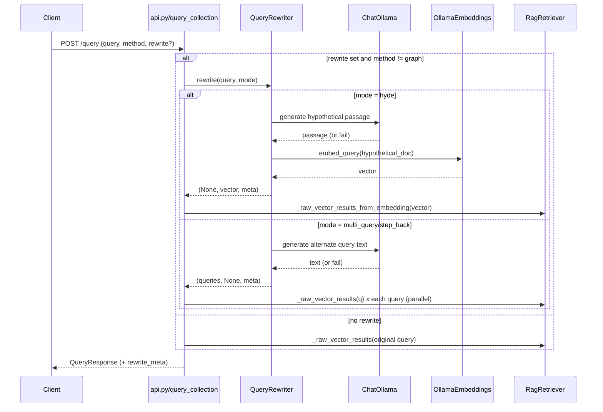

# Data Flow: Query Rewriter (`rewriter.py`)

---

## 1. Purpose and Scope

`QueryRewriter` is a stateless, request-time query pre-processor used by `POST /collections/{name}/query`.

It supports three rewrite strategies:

1. `hyde`: generate a hypothetical answer passage and use its embedding for retrieval.
2. `multi_query`: generate multiple paraphrases and merge retrieval results.
3. `step_back`: generate a broader question and retrieve with both original + broader queries.

The class lives in `rewriter.py` and returns a `RewriteMeta` object for transparency in API responses and streaming events.

---

## 2. Runtime Placement in the Request Pipeline

`api.py` computes rewrite output early in `query_collection()` when:

- `body.rewrite is not None`, and
- `body.method != "graph"`.

High-level order:

```
query_collection()
  ├─ Step 1: optional rewrite (QueryRewriter.rewrite)
  ├─ Step 2: optional self-RAG branch
  └─ Step 3: regular retrieval/generation branch
```

Important behavior:

- Graph-only queries (`method="graph"`) skip rewriting entirely.
- `rewrite_meta` is still included in `QueryResponse` (or SSE `rewrite_meta` event) whenever rewrite ran.
- In the `self_rag=true` path, rewrite is currently metadata-only (the reflector loop still uses the original query string).

---

## 3. Inputs and Dependencies

`QueryRewriter` constructor:

- `llm`: shared `ChatOllama` instance from `rag._chat_service`.
- `embedding_service`: shared `OllamaEmbeddings` from `rag._retriever._query_embedding_service`.

Both are reused from the existing retriever stack so there is no extra model bootstrap cost per request.

---

## 4. Public Contract

Dispatcher signature:

```python
async def rewrite(query: str, mode: str) -> tuple[list[str] | None, list[float] | None, RewriteMeta]
```

Return contract by mode:

- `hyde`:
  - `queries_or_None = None`
  - `hyde_embedding_or_None = list[float]`
  - `meta.mode = "hyde"`
- `multi_query` / `step_back`:
  - `queries_or_None = list[str]`
  - `hyde_embedding_or_None = None`
  - `meta.mode = "multi_query"` or `"step_back"`

Unknown mode raises:

```python
ValueError(f"Unknown rewrite mode: {mode!r}")
```

---

## 5. Mode-by-Mode Data Flow

## 5.1 HyDE (`hyde`)

Goal: search using the embedding of a model-generated hypothetical answer passage.

```
user query
   │
   ▼
System prompt:
  "Write a short factual passage (2-4 sentences) that directly answers
   the following question. Do not include the question itself."
   │
   ▼
llm.ainvoke(messages)
   │
   ├─ success: hypothetical_doc = response.content
   └─ failure: hypothetical_doc = original query
   │
   ▼
asyncio.to_thread(embedder.embed_query, hypothetical_doc)
   │
   ▼
return (embedding_vector, RewriteMeta)
```

Produced metadata:

- `mode="hyde"`
- `original_query=<input>`
- `rewritten_queries=[hypothetical_doc]`
- `hypothetical_document=hypothetical_doc`

Failure behavior:

- LLM failure logs warning and falls back to embedding the original query.

---

## 5.2 Multi-Query (`multi_query`)

Goal: increase recall by querying multiple paraphrases.

```
user query
   │
   ▼
System prompt:
  "Generate N alternative phrasings ...
   Output one phrasing per line, no numbering, no blank lines."
   │
   ▼
llm.ainvoke(messages)
   │
   ├─ success:
   │    raw text -> splitlines -> strip -> drop empty -> take first N
   │    alternatives = [...]
   └─ failure:
        alternatives = []
   │
   ▼
all_queries = [original_query] + alternatives
   │
   ▼
return (all_queries, RewriteMeta)
```

Produced metadata:

- `mode="multi_query"`
- `original_query=<input>`
- `rewritten_queries=[original, alt1, alt2, ...]`
- `hypothetical_document=None`

Failure behavior:

- LLM failure logs warning and returns only the original query.

---

## 5.3 Step-Back (`step_back`)

Goal: add a broader conceptual query to complement the original.

```
user query
   │
   ▼
System prompt:
  "Rewrite the user's question as a broader, more general question...
   Output only the rewritten question, nothing else."
   │
   ▼
llm.ainvoke(messages)
   │
   ├─ success: step_back_query = stripped model text
   └─ failure: step_back_query = original query
   │
   ▼
all_queries = [original_query, step_back_query]
   │
   ▼
return (all_queries, RewriteMeta)
```

Produced metadata:

- `mode="step_back"`
- `original_query=<input>`
- `rewritten_queries=[original, step_back_query]`
- `hypothetical_document=None`

Failure behavior:

- LLM failure logs warning and uses original query as fallback.

---

## 6. Consumption in `api.py`

After rewrite is computed, retrieval behavior differs by mode.

### 6.1 HyDE retrieval path

```
_hyde_embedding from QueryRewriter
   │
   ▼
rag._raw_vector_results_from_embedding(_hyde_embedding, top_k)
   │
   ▼
raw rows -> vector_context + sources
```

### 6.2 Multi-query / step-back retrieval path

```
_rewrite_queries from QueryRewriter
   │
   ▼
asyncio.gather(*[rag._raw_vector_results(q, top_k) for q in _rewrite_queries])
   │
   ▼
flatten all batches
   │
   ▼
deduplicate by key = (doc_id, chunk_index)
   │
   ▼
vector_context + sources
```

### 6.3 Hybrid and graph context

- If `method="hybrid"`, graph context is fetched in addition to rewritten vector retrieval.
- If `method="graph"`, rewrite does not run.

---

## 7. Response and Streaming Visibility

`RewriteMeta` schema (`models.py`):

- `mode: str`
- `original_query: str`
- `rewritten_queries: list[str]`
- `hypothetical_document: str | None`

Non-streaming:

- Returned in `QueryResponse.rewrite_meta`.

Streaming (`_stream_answer_inner`):

- Emits SSE event first when available:

```
event: rewrite_meta
data: { ...RewriteMeta... }
```

This lets the UI render rewrite details before chunk/context/token events arrive.

---

## 8. Error Handling and Safety Characteristics

The rewriter is fail-soft by design:

- Each strategy catches model errors and falls back to original-query behavior.
- Fallback always preserves a valid retrieval path (no hard failure on rewrite generation failure).
- Unknown mode is a hard validation failure (`ValueError`) at dispatcher level.

Operational implications:

- Rewrite failures reduce optimization quality but do not block answering.
- HyDE may degrade to baseline vector search if hypothetical passage generation fails.
- Multi-query/step-back may collapse to single-query behavior on failure.

---

## 9. End-to-End Sequence Diagram



---

## 10. Current Design Notes

1. Rewrite executes before the self-RAG branch, but self-RAG currently does not consume rewritten queries/embeddings for retrieval.
2. Rewriter prompts are concise and intentionally constrained to reduce output formatting noise.
3. QueryRewriter is stateless; all per-request state is in local variables and returned metadata.
